# Code Nexus

A university **placement-management platform**: provision universities, companies
and students; run placement drives end to end; practise DSA in an in-house judge;
hold timed contests and webinars; conduct **live WebRTC interviews** with a shared
IDE and whiteboard; and **record, chapter and review** those interviews afterwards.

Built as a **modular monolith in a Turborepo** — one core API process plus three
purpose-built satellite processes, sharing a typed contract package.

> **Status: Phases 1–10 complete.** The platform is feature-complete end to end.
> Remaining hardening items are listed under [Known gaps](#known-gaps).

---

## Table of contents

1. [System design](#system-design)
2. [Quick start](#quick-start)
3. [Repository layout](#repository-layout)
4. [The services](#the-services)
   - [apps/api](#appsapi--the-core-server) · [apps/web](#appsweb--the-client) ·
     [apps/ws-gateway](#appsws-gateway--the-real-time-plane) ·
     [apps/execution-worker](#appsexecution-worker--untrusted-code-execution)
5. [Shared packages](#shared-packages)
6. [Infrastructure services](#infrastructure-services)
7. [Cross-cutting concerns](#cross-cutting-concerns)
8. [Domain workflows](#domain-workflows)
9. [Data model](#data-model)
10. [API reference](#api-reference)
11. [Environment variables](#environment-variables)
12. [Testing strategy](#testing-strategy)
13. [Failure modes & graceful degradation](#failure-modes--graceful-degradation)
14. [Design decisions](#design-decisions)
15. [Known gaps](#known-gaps)
16. [Troubleshooting](#troubleshooting)

---

## System design

### Topology

Four application processes, five infrastructure containers. **Only the API talks
to the browser over HTTP**; the gateway owns WebSockets; the worker owns untrusted
code; media never passes through either.

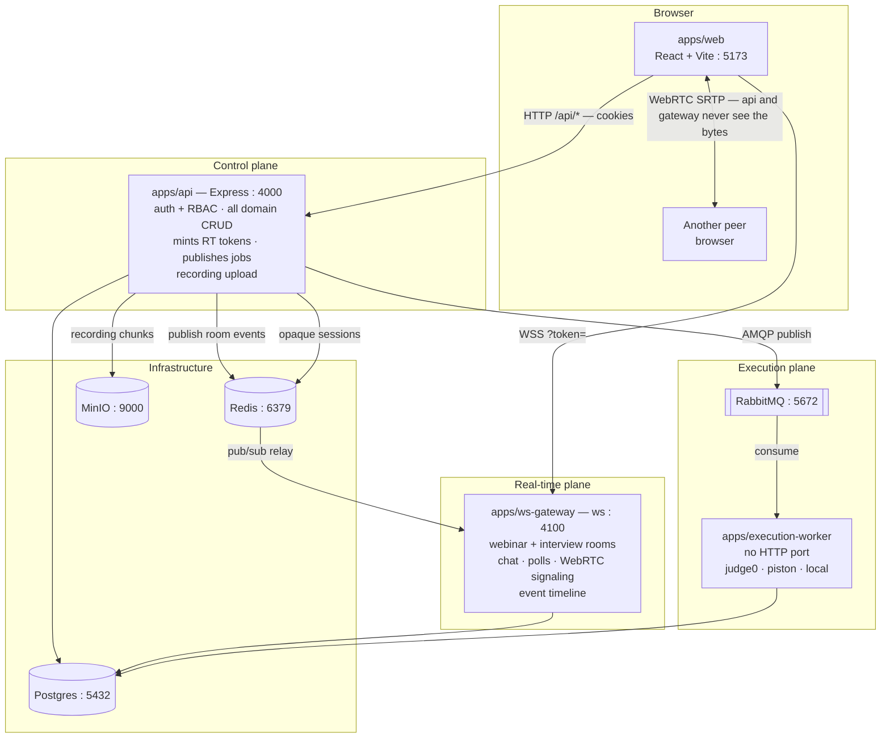
```mermaid
flowchart TB
    subgraph client["Browser"]
        WEB["apps/web<br/>React + Vite : 5173"]
        PEER["Another peer<br/>browser"]
    end

    subgraph ctrl["Control plane"]
        API["apps/api — Express : 4000<br/>auth + RBAC · all domain CRUD<br/>mints RT tokens · publishes jobs<br/>recording upload"]
    end

    subgraph rt["Real-time plane"]
        GW["apps/ws-gateway — ws : 4100<br/>webinar + interview rooms<br/>chat · polls · WebRTC signaling<br/>event timeline"]
    end

    subgraph exec["Execution plane"]
        MQ[["RabbitMQ : 5672"]]
        WORKER["apps/execution-worker<br/>no HTTP port<br/>judge0 · piston · local"]
    end

    subgraph infra["Infrastructure"]
        PG[("Postgres : 5432")]
        REDIS[("Redis : 6379")]
        MINIO[("MinIO : 9000")]
    end

    WEB -->|"HTTP /api/* — cookies"| API
    WEB -->|"WSS ?token="| GW
    WEB <-->|"WebRTC SRTP — api and gateway never see the bytes"| PEER

    API -->|"AMQP publish"| MQ
    MQ -->|"consume"| WORKER

    API -->|"publish room events"| REDIS
    REDIS -->|"pub/sub relay"| GW

    API --> PG
    GW --> PG
    WORKER --> PG
    API -->|"opaque sessions"| REDIS
    API -->|"recording chunks"| MINIO
```

### The three planes

The single most important idea in this codebase: **control, real-time and media
are separate planes**, and the boundaries are enforced, not conventional.

| Plane         | Carrier                    | Owns                                                                           | Never does                                                 |
| ------------- | -------------------------- | ------------------------------------------------------------------------------ | ---------------------------------------------------------- |
| **Control**   | `apps/api` over HTTPS      | Identity, authorization, all persistence, lifecycle transitions, token minting | Execute code · open a WebSocket · proxy live media         |
| **Real-time** | `apps/ws-gateway` over WSS | Room membership, chat, polls, presence, WebRTC signaling relay, event timeline | Parse SDP · authorize from the session store · touch media |
| **Media**     | Out of band                | HLS (webinars) · WebRTC SRTP (interviews)                                      | Pass through the API or the gateway                        |

**The one deliberate exception**, documented because it is a real crossing:
recording chunks are POSTed to the API and handed to a storage driver. That is
**store-and-forward**, not a live media path — the interview itself is unaffected
if it fails.

### Architectural rules

These hold everywhere; a violation is a bug.

1. **The server authorizes; the client never gates.** Every route re-derives
   identity, role, org scope and eligibility from the session. UI guards are UX.
2. **Cross-tenant access returns `404`, not `403`** — a `403` confirms the
   resource exists. A role missing a permission outright still gets `403`.
3. **One contract package.** Every DTO, enum, WSS frame and job payload is
   declared once in `@code-nexus/types` with zod, and imported by API, gateway,
   worker and web. Drift is a compile error.
4. **Nothing reads `process.env` except `@code-nexus/config`**, which validates
   with zod and fails fast at boot.
5. **Infra-optional by default.** Every heavy dependency is pluggable and has a
   working zero-infra default (see the [degradation matrix](#failure-modes--graceful-degradation)).
6. **Soft delete + UTC everywhere.** Every model carries `id`, `publicId`,
   `createdAt`, `updatedAt`, `deletedAt`; all timestamps are `timestamptz`.
7. **`publicId` is the only identifier that crosses a process boundary.**
   Internal `id`s never appear in a DTO, URL or log.

---

## Quick start

### Prerequisites

| Tool   | Version                  |
| ------ | ------------------------ |
| Node   | 20 LTS (`.nvmrc`)        |
| pnpm   | 11.x (`corepack enable`) |
| Docker | for local infra          |

### Bootstrap

```bash
pnpm install                 # 1. dependencies
cp .env.example .env         # 2. environment

pnpm infra:up                # 3. Postgres, Redis, RabbitMQ, MinIO (waits healthy)
pnpm infra:init              #    one-time: create the MinIO bucket

pnpm db:generate             # 4. Prisma client
pnpm db:migrate              #    apply migrations
pnpm db:seed                 #    idempotent demo data

pnpm dev                     # 5. all four apps
```

Verify:

- API health → <http://localhost:4000/health>
- Web → <http://localhost:5173>
- Gateway → `ws://localhost:4100/ws` (HTTP `GET` returns `426 Upgrade Required`, which is correct)

### Seeded accounts

All use password `ChangeMe!123`.

| Email                        | Role       | Notes                               |
| ---------------------------- | ---------- | ----------------------------------- |
| `admin@codenexus.local`      | ADMIN      | Provisions universities/companies   |
| `university@codenexus.local` | UNIVERSITY | Demo University (`DEMO-UNI`)        |
| `company@codenexus.local`    | COMPANY    | Demo Company                        |
| `recruiter@codenexus.local`  | RECRUITER  | Riya Recruiter, conducts interviews |
| `student@codenexus.local`    | STUDENT    | Sam Student, CS 2026, CGPA 8.5      |

The seed also creates a published drive (_SDE-1 Campus Hiring 2026_) with Sam
already **SHORTLISTED**, plus a 6-question arena bank — enough to schedule an
interview immediately without clicking through the whole funnel.

> **Two-browser testing:** an interview needs two _sessions_, not two tabs. Use a
> normal window and a private window (or two browser profiles).

### Port map

| Process / container     | Port         | Notes                                                   |
| ----------------------- | ------------ | ------------------------------------------------------- |
| `apps/api`              | 4000         | HTTP                                                    |
| `apps/web`              | 5173         | Vite dev server, proxies `/api/*` → 4000                |
| `apps/ws-gateway`       | 4100         | WSS at `/ws`                                            |
| `apps/execution-worker` | —            | No listener; AMQP consumer only                         |
| PostgreSQL              | 5432         |                                                         |
| Redis                   | 6379         | Sessions + pub/sub                                      |
| RabbitMQ                | 5672 / 15672 | AMQP / management UI                                    |
| MinIO                   | 9000 / 9001  | S3 API / console                                        |
| media (RTMP→HLS)        | 1935 / 8888  | `--profile media`, only for `MEDIA_PROVIDER=selfhosted` |

### Scripts

| Script                                                      | Description                                                |
| ----------------------------------------------------------- | ---------------------------------------------------------- |
| `pnpm dev`                                                  | Run all apps + package watchers (Turbo, `concurrency: 15`) |
| `pnpm build` / `lint` / `typecheck` / `test`                | Workspace-wide                                             |
| `pnpm format`                                               | Prettier write                                             |
| `pnpm db:generate` / `db:migrate` / `db:seed` / `db:studio` | Prisma                                                     |
| `pnpm infra:up` / `infra:init` / `infra:down`               | Docker infra                                               |

---

## Repository layout

```
apps/
  api/                 Express modular monolith — the control plane
  web/                 React + Vite + Tailwind v4 — the only UI
  ws-gateway/          Standalone WSS server — the real-time plane
  execution-worker/    RabbitMQ consumer — runs untrusted code

packages/
  types/               zod + TS contracts — the single source of truth
  db/                  Prisma schema, client singleton, seed
  auth/                RBAC matrix, sessions, password hashing, RT tokens
  config/              zod-validated env loader (fail-fast)
  logger/              pino wrapper with request-id correlation
  mq/                  typed amqplib wrappers (durable + dead-letter)
  eslint-config/       shared flat config
  tsconfig/            shared TS bases

docker/                media server config (nginx-rtmp)
report.md              original architecture study
```

---

## The services

### `apps/api` — the core server

**Express, ESM, port 4000.** The only process the browser talks to over HTTP, and
the only writer of most domain state.

**Responsibilities**

- Authentication, session lifecycle, CSRF, RBAC enforcement
- Every domain module's CRUD and lifecycle transitions
- Minting short-lived **RT tokens** the gateway verifies
- Publishing execution jobs to RabbitMQ
- Handing out **ICE server config** for WebRTC
- Accepting **recording chunk uploads** and delegating to a storage driver
- Publishing host-originated events to Redis for the gateway to relay

**Explicitly not responsible for:** executing code, opening a WebSocket, proxying
live media, or storing anything the worker owns.

**Composition.** `createApp(deps)` takes an injected `ApiDeps`, which is what
makes the whole suite testable without infrastructure:

```ts
interface ApiDeps {
  logger: Logger;
  config: AppConfig;
  sessionStore: SessionStore; // Redis in prod, in-memory in tests
  publisher: Publisher | null; // null → arena/interview run returns 503
  roomBus: RoomBus | null; // null → live fan-out skipped, writes persist
  recordingStorage: RecordingStorage | null; // null → uploads 503
}
```

Every optional dependency is `null`-able **by design**: a missing broker or
storage backend degrades one feature, never the process.

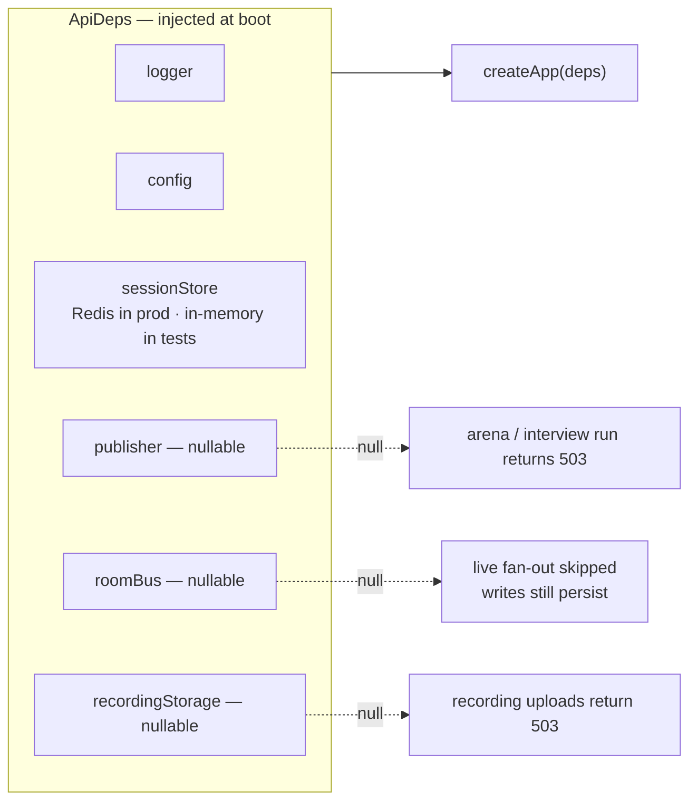
```mermaid
flowchart LR
    subgraph d["ApiDeps — injected at boot"]
        L["logger"]
        CF["config"]
        SS["sessionStore<br/>Redis in prod · in-memory in tests"]
        PB["publisher — nullable"]
        RB["roomBus — nullable"]
        RS["recordingStorage — nullable"]
    end

    d --> APP["createApp(deps)"]

    PB -.->|"null"| X1["arena / interview run returns 503"]
    RB -.->|"null"| X2["live fan-out skipped<br/>writes still persist"]
    RS -.->|"null"| X3["recording uploads return 503"]
```

**Middleware order** (`app.ts`) — order is significant:

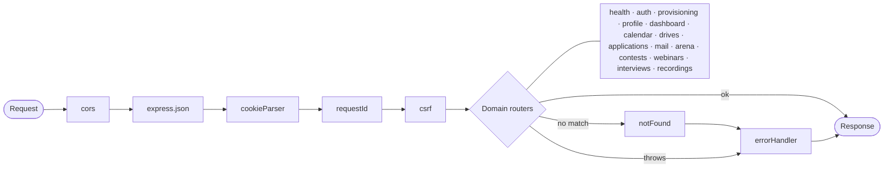
```mermaid
flowchart LR
    REQ(["Request"]) --> MW1["cors"] --> MW2["express.json"] --> MW3["cookieParser"] --> MW4["requestId"] --> MW5["csrf"] --> ROUTERS{"Domain routers"}

    ROUTERS -->|"no match"| NF["notFound"]
    NF --> EH["errorHandler"]
    ROUTERS -->|"throws"| EH
    ROUTERS -->|"ok"| RES(["Response"])
    EH --> RES

    subgraph mods["health · auth · provisioning · profile · dashboard · calendar · drives · applications · mail · arena · contests · webinars · interviews · recordings"]
        direction LR
    end
    ROUTERS --- mods
```

`express.json()` skips non-JSON bodies, which is what lets the recordings router
attach its own `express.raw()` parser for binary chunks on one route only.

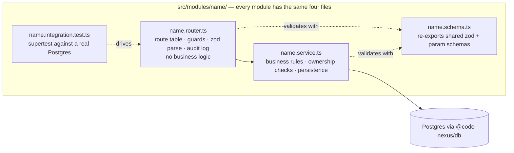
```mermaid
flowchart LR
    subgraph mod["src/modules/name/ — every module has the same four files"]
        RT["name.router.ts<br/>route table · guards · zod parse · audit log<br/>no business logic"]
        SV["name.service.ts<br/>business rules · ownership checks · persistence"]
        SC["name.schema.ts<br/>re-exports shared zod + param schemas"]
        TS["name.integration.test.ts<br/>supertest against a real Postgres"]
    end

    RT --> SV --> DB[("Postgres via @code-nexus/db")]
    RT -.->|"validates with"| SC
    SV -.->|"validates with"| SC
    TS -.->|"drives"| RT
```

**Module anatomy.** Every domain module under `src/modules/<name>/` follows the
same four-file shape:

| File                         | Responsibility                                       |
| ---------------------------- | ---------------------------------------------------- |
| `<name>.router.ts`           | Route table, guards, zod parse, audit log. No logic. |
| `<name>.service.ts`          | All business rules, ownership checks, persistence.   |
| `<name>.schema.ts`           | Re-exports the shared zod schemas + param schemas.   |
| `<name>.integration.test.ts` | supertest against a real Postgres.                   |

Modules: `auth`, `provisioning`, `profile`, `dashboard`, `calendar`, `drives`,
`applications`, `mail`, `arena`, `contests`, `webinars`, `interviews`,
`recordings`.

---

### `apps/web` — the client

**React 19 + Vite + Tailwind v4 + React Router + TanStack Query**, port 5173.

**State model.** Server state lives in TanStack Query, never in a store. Identity
comes **only** from `GET /auth/me` — never localStorage, so a suspended account
loses access on its next request rather than at next login.

**Dev proxy.** The app calls relative `/api/*`, which Vite proxies to port 4000.
Same-origin means cookies and CSRF work with no CORS configuration. For a
split-origin deploy set `WEB_ORIGIN` on the API.

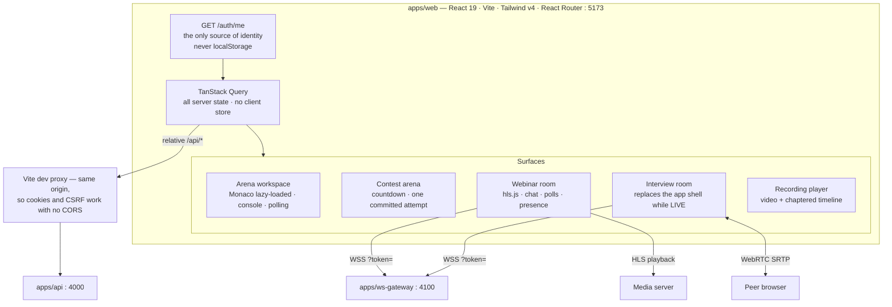
```mermaid
flowchart TB
    subgraph spa["apps/web — React 19 · Vite · Tailwind v4 · React Router : 5173"]
        ME["GET /auth/me<br/>the only source of identity<br/>never localStorage"]
        TQ["TanStack Query<br/>all server state · no client store"]
        subgraph surf["Surfaces"]
            AR["Arena workspace<br/>Monaco lazy-loaded · console · polling"]
            CO["Contest arena<br/>countdown · one committed attempt"]
            WB["Webinar room<br/>hls.js · chat · polls · presence"]
            IV["Interview room<br/>replaces the app shell while LIVE"]
            RP["Recording player<br/>video + chaptered timeline"]
        end
        ME --> TQ
        TQ --> surf
    end

    TQ -->|"relative /api/*"| PX["Vite dev proxy — same origin,<br/>so cookies and CSRF work with no CORS"]
    PX --> API["apps/api : 4000"]

    WB -->|"WSS ?token="| GW["apps/ws-gateway : 4100"]
    IV -->|"WSS ?token="| GW
    WB -->|"HLS playback"| MS["Media server"]
    IV <-->|"WebRTC SRTP"| PEER["Peer browser"]
```

**Notable UI surfaces**

| Area               | Highlights                                                    |
| ------------------ | ------------------------------------------------------------- |
| Arena workspace    | Monaco editor, language selector, console, submission polling |
| Contest arena      | Countdown, problem switcher, one-committed-attempt guard      |
| Webinar room       | hls.js player, chat, polls, presence                          |
| **Interview room** | Full-viewport Meet-style room (see below)                     |
| Recording player   | `<video>` + chaptered timeline built from the event log       |

**The interview room** deliberately **replaces the app shell**: while an interview
is LIVE there is no sidebar and no navigation, so neither party can wander off
mid-question. It opens as a plain call; whiteboard and IDE are opt-in from the
dock, and opening either is a **shared** action that moves every participant's
screen. Chat/people/question are local panels.

Monaco is lazy-loaded; nothing else in the app depends on it.

---

### `apps/ws-gateway` — the real-time plane

**A standalone `ws` server on port 4100 — not part of the API.** It serves **two
room kinds from one process**, dispatched by the RT token's `kind` field.

**Why a separate process.** The API stays a stateless request/response server that
can be scaled and restarted freely; long-lived sockets and their in-memory room
state live somewhere they cannot take the API down with them.

**Authentication — RT tokens, not cookies.** The gateway never reads the session
store. The API mints a short-lived HMAC token; the client connects to
`ws://…/ws?token=…`; the gateway verifies signature + expiry with the shared
`RT_TOKEN_SECRET`. This keeps the gateway stateless and cross-origin-safe.

```ts
interface RtTokenPayload {
  kind: 'webinar' | 'interview'; // dispatch key
  roomId: string; // internal id — the gateway loads by this
  roomPublicId: string;
  userId: string;
  publicId: string;
  role: 'HOST' | 'VIEWER' | 'INTERVIEWER' | 'CANDIDATE';
  displayName: string;
  studentId?: string; // viewer attendance / candidate
  exp: number; // epoch seconds
}
```

**Horizontal scaling via Redis pub/sub.** Each instance `psubscribe`s
`webinar:*` and `interview:*`. A message published by any API or gateway instance
is relayed into every instance's local rooms, so N gateways stay consistent.

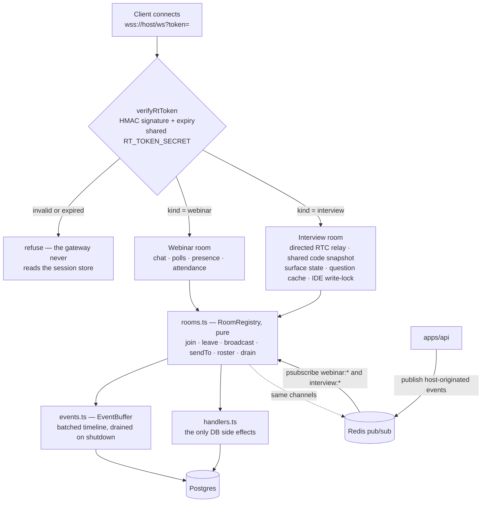
```mermaid
flowchart TB
    CL["Client connects<br/>wss://host/ws?token="] --> VF{"verifyRtToken<br/>HMAC signature + expiry<br/>shared RT_TOKEN_SECRET"}

    VF -->|"invalid or expired"| CLOSE["refuse — the gateway never<br/>reads the session store"]
    VF -->|"kind = webinar"| WR["Webinar room<br/>chat · polls · presence · attendance"]
    VF -->|"kind = interview"| IR["Interview room<br/>directed RTC relay · shared code snapshot<br/>surface state · question cache · IDE write-lock"]

    WR --> REG["rooms.ts — RoomRegistry, pure<br/>join · leave · broadcast · sendTo · roster · drain"]
    IR --> REG

    REG --> EV["events.ts — EventBuffer<br/>batched timeline, drained on shutdown"]
    REG --> HD["handlers.ts<br/>the only DB side effects"]
    HD --> PG[("Postgres")]
    EV --> PG

    API["apps/api"] -->|"publish host-originated events"| R[("Redis pub/sub")]
    R -->|"psubscribe webinar:* and interview:*"| REG
    REG -.->|"same channels"| R
```

**Internal structure**

| File           | Contents                                                                                                                                                                                               |
| -------------- | ------------------------------------------------------------------------------------------------------------------------------------------------------------------------------------------------------ |
| `rooms.ts`     | `RoomRegistry` (join/leave/broadcast/**sendTo**/roster/drain), `parseInbound`, `RateLimiter`. **Pure** — a connection is an id + a `send` callback, so every branch is unit-testable without a socket. |
| `interview.ts` | Interview room: directed WebRTC relay, shared code snapshot, surface state, question cache, IDE write-lock.                                                                                            |
| `events.ts`    | Phase-10 timeline: `buildEvent`, `EventBuffer` (batched, drained on shutdown). Pure.                                                                                                                   |
| `handlers.ts`  | The only DB side effects (chat, votes, attendance, event persistence).                                                                                                                                 |
| `index.ts`     | Socket glue, Redis wiring, graceful shutdown.                                                                                                                                                          |

**Interview room rules — enforced server-side, mirrored in UI:**

| Surface             | Who may write      | Enforcement                                                                                           |
| ------------------- | ------------------ | ----------------------------------------------------------------------------------------------------- |
| Shared **IDE**      | **Candidate only** | `code:update` from any other role is refused with `FORBIDDEN`; interviewers watch it stream read-only |
| **Whiteboard**      | Both sides         | Collaborative by design                                                                               |
| **Active surface**  | Anyone             | A candidate reaching for the whiteboard mid-answer is the point                                       |
| **Pinned question** | Interviewer only   | Runs through the API, not the socket                                                                  |

**Directed signaling.** `rtc:offer/answer/ice` carry a `to` peer id and are
delivered to that peer alone — never broadcast. The gateway never parses SDP.
Glare is avoided by `isOfferer`: the lexicographically smaller peer id offers, so
exactly one side initiates per pair with no coordination.

**Late-joiner replay.** On join the gateway sends the current code snapshot,
pinned question, and active surface, so a reconnecting peer lands on the same
screen as everyone else instead of a stale default.

---

### `apps/execution-worker` — untrusted code execution

**A standalone AMQP consumer with no HTTP listener.** This process exists for one
reason: **the API must never execute user code.**

**Flow.** The API writes `Submission(QUEUED)` and publishes only
`{ submissionPublicId }`. The worker loads the submission and testcases from
Postgres by id — **source code and testcases never enter the broker** — runs them,
grades, and persists the result. The browser polls the API.

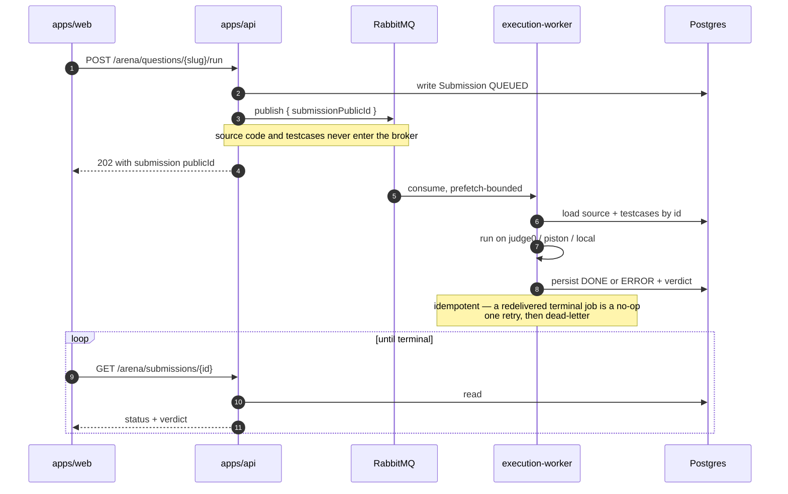
```mermaid
sequenceDiagram
    autonumber
    participant W as apps/web
    participant A as apps/api
    participant Q as RabbitMQ
    participant K as execution-worker
    participant P as Postgres

    W->>A: POST /arena/questions/{slug}/run
    A->>P: write Submission QUEUED
    A->>Q: publish { submissionPublicId }
    Note over A,Q: source code and testcases never enter the broker
    A-->>W: 202 with submission publicId

    Q->>K: consume, prefetch-bounded
    K->>P: load source + testcases by id
    K->>K: run on judge0 / piston / local
    K->>P: persist DONE or ERROR + verdict
    Note over K: idempotent — a redelivered terminal job is a no-op<br/>one retry, then dead-letter

    loop until terminal
        W->>A: GET /arena/submissions/{id}
        A->>P: read
        A-->>W: status + verdict
    end
```

**Pluggable engines** (`EXECUTION_ENGINE`):

| Engine             | Isolation                             | Use                                                                                  |
| ------------------ | ------------------------------------- | ------------------------------------------------------------------------------------ |
| `judge0` (default) | Full `isolate` sandbox                | Production. Self-hosted needs Linux cgroups; RapidAPI is the practical path on macOS |
| `piston`           | Container sandbox                     | Self-hosted alternative                                                              |
| `local`            | `sandbox-exec` + `ulimit` + `timeout` | **DEMO/DEV ONLY** — runs on your machine. Never deploy this                          |

**Reliability.** `prefetch`-bounded; idempotent (a redelivered terminal job is a
no-op); one retry then dead-letter; an engine failure marks the submission
`ERROR` rather than hanging. Grading is whitespace-insensitive (trailing
whitespace per line and trailing newlines trimmed).

Kill the worker and the API stays fully up — submissions sit `QUEUED` and are
reaped to `ERROR` on read after ~45s.

---

## Shared packages

| Package                                             | Purpose                                                                                                                                                              | Key exports                                                                                                                                                           |
| --------------------------------------------------- | -------------------------------------------------------------------------------------------------------------------------------------------------------------------- | --------------------------------------------------------------------------------------------------------------------------------------------------------------------- |
| **`@code-nexus/types`**                             | The contract. Every DTO, enum, WSS frame, job payload, and all **pure domain logic** (so it is testable everywhere it is used).                                      | `ALLOWED_APPLICATION_TRANSITIONS`, `evaluateEligibility`, `deriveContestPhase`, `isOfferer`, `canEditSharedCode`, `electRecorder`, `locateOffset`, `canViewRecording` |
| **`@code-nexus/db`**                                | Prisma schema (29 models, 21 enums, 11 migrations), client singleton, seed. Shared by API, gateway and worker.                                                       | `prisma`, `Prisma`                                                                                                                                                    |
| **`@code-nexus/auth`**                              | Permission catalog + 5-role matrix (deny-by-default), ownership scoping, Redis/in-memory session stores, bcrypt hashing, RT token sign/verify, mail direction rules. | `can`, `PERMISSIONS`, `ROLE_PERMISSIONS`, `signRtToken`, `verifyRtToken`, `canMail`                                                                                   |
| **`@code-nexus/config`**                            | The only module that reads `process.env`. zod-validated, fails fast, walks up to the workspace root for `.env`.                                                      | `loadConfig`, `AppConfig`                                                                                                                                             |
| **`@code-nexus/logger`**                            | pino wrapper, request-id correlation, pretty in dev.                                                                                                                 | `createLogger`                                                                                                                                                        |
| **`@code-nexus/mq`**                                | Typed amqplib over a durable queue with a dead-letter queue.                                                                                                         | `createBroker`, `publishJob`, `consumeJobs`                                                                                                                           |
| `@code-nexus/eslint-config`, `@code-nexus/tsconfig` | Shared tooling config.                                                                                                                                               |                                                                                                                                                                       |

Putting the **pure logic** in `types` rather than in a service is deliberate: the
same eligibility rule, state machine, or write-lock predicate runs identically on
the client, the API and the gateway, and is unit-tested once with no I/O.

---

## Infrastructure services

| Service                            | Role                                         | Failure impact                                                            |
| ---------------------------------- | -------------------------------------------- | ------------------------------------------------------------------------- |
| **PostgreSQL 16**                  | System of record for everything.             | Fatal — the platform is down                                              |
| **Redis 7**                        | Opaque sessions (revocable) + room pub/sub.  | Fatal for the API (fails fast at boot); rooms lose cross-instance fan-out |
| **RabbitMQ 3**                     | Execution job queue (durable + DLQ).         | Run/Submit → `503`; everything else fine                                  |
| **MinIO**                          | S3-compatible object storage for recordings. | Only needed when `RECORDING_STORAGE=s3`                                   |
| **nginx-rtmp** (`--profile media`) | RTMP ingest → HLS playback for webinars.     | Only for `MEDIA_PROVIDER=selfhosted`; `stub` needs nothing                |

MinIO is **already provisioned** by `pnpm infra:init` (bucket `code-nexus-dev`)
and speaks the S3 API, so the `s3` recording driver can be exercised locally with
no AWS account.

---

## Cross-cutting concerns

### Authentication

**Opaque server-side sessions in Redis, not JWTs** — so they are revocable for
suspend and logout-everywhere. Referenced by a signed `httpOnly` `cn_session`
cookie. On every request the session is re-validated and the user's `role` and
`status` are reloaded **live from the database**, so a suspension takes effect
immediately rather than at token expiry. Sessions carry both an absolute TTL and a
sliding idle timeout, and rotate on login and password change.

### CSRF

Double-submit: a JS-readable `cn_csrf` cookie must match an `X-CSRF-Token` header
on every state-changing request.

### RBAC

A `"<resource>:<action>"` permission catalog and a 5-role matrix in
`@code-nexus/auth`, **deny-by-default**, verified by an exhaustive
role × permission test (268 cases).

| Role           | Scope                                                      |
| -------------- | ---------------------------------------------------------- |
| **ADMIN**      | Unscoped. Provisions orgs, manages the question bank       |
| **UNIVERSITY** | Its own students, its drives, its contests/webinars        |
| **COMPANY**    | Its own drives, recruiters, contests, webinars, interviews |
| **RECRUITER**  | The interviews it is **assigned to conduct**               |
| **STUDENT**    | Its own applications, submissions, interviews, recordings  |

Two distinct mechanisms, often confused:

- **Permission** — may this role ever do this? Missing → `403`.
- **Ownership scope** — may this actor do it _to this resource_? Missing → `404`.

`interview:manage` on RECRUITER illustrates it: the permission opens the route,
but the service still requires the caller to be an assigned interviewer on that
specific interview, so it means "run the calls I was put on", nothing wider.

### Provisioning — no self-signup

Admin → Universities/Companies/Admins; University → Students; Company →
Recruiters. Each creates a `User` + role row in one transaction and returns a
**one-time** crypto-random temp password with `mustResetPassword=true`. First
login forces a password change; Students/Recruiters then complete a profile,
flipping `PENDING_PROFILE → ACTIVE`. Password hashes and temp passwords never
appear in a response or a log.

### Errors

One envelope, always:

```jsonc
{ "error": { "code": "NOT_ELIGIBLE", "message": "…", "requestId": "…" } }
```

| Code                                             | HTTP | Meaning                                  |
| ------------------------------------------------ | ---- | ---------------------------------------- |
| `VALIDATION`                                     | 400  | zod rejected the input                   |
| `UNAUTHENTICATED`                                | 401  | No/expired session                       |
| `INVALID_CREDENTIALS`                            | 401  | Login failed                             |
| `FORBIDDEN`                                      | 403  | Role lacks the permission                |
| `CSRF`                                           | 403  | Token mismatch                           |
| `PASSWORD_RESET_REQUIRED` / `PROFILE_INCOMPLETE` | 403  | Onboarding gate                          |
| `NOT_ELIGIBLE`                                   | 403  | Eligibility rules failed (with reasons)  |
| `NOT_FOUND`                                      | 404  | Missing **or** out of the caller's scope |
| `CONFLICT`                                       | 409  | Illegal state transition / duplicate     |
| `PAYLOAD_TOO_LARGE`                              | 413  | Body over its cap (recording chunks)     |
| `RATE_LIMITED`                                   | 429  | In-flight or token-bucket cap            |
| `SERVICE_UNAVAILABLE`                            | 503  | Optional dependency down                 |

### Observability

`pino` structured logs with a per-request `requestId` propagated through
`req.log`. Every privileged action emits an audit line with actor `publicId`,
action, target and outcome. Recording views/downloads/deletes additionally
persist a `RecordingAccessLog` row.

---

## Domain workflows

### 1. Provisioning and first login

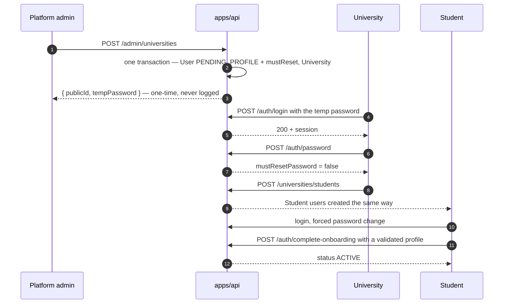
```mermaid
sequenceDiagram
    autonumber
    participant AD as Platform admin
    participant API as apps/api
    participant UNI as University
    participant STU as Student

    AD->>API: POST /admin/universities
    API->>API: one transaction — User PENDING_PROFILE + mustReset, University
    API-->>AD: { publicId, tempPassword } — one-time, never logged

    UNI->>API: POST /auth/login with the temp password
    API-->>UNI: 200 + session
    UNI->>API: POST /auth/password
    API-->>UNI: mustResetPassword = false
    UNI->>API: POST /universities/students
    API-->>STU: Student users created the same way

    STU->>API: login, forced password change
    STU->>API: POST /auth/complete-onboarding with a validated profile
    API-->>STU: status ACTIVE
```

### 2. Placement drive funnel

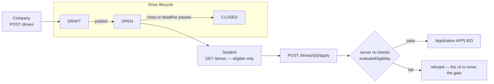
```mermaid
flowchart LR
    D1["Company<br/>POST /drives"] --> DRAFT
    subgraph life["Drive lifecycle"]
        direction LR
        DRAFT -->|"publish"| OPEN
        OPEN -->|"close or deadline passes"| CLOSED
    end

    OPEN --> G["Student<br/>GET /drives — eligible only"]
    G --> AP["POST /drives/{id}/apply"]
    AP --> CHK{"server re-checks<br/>evaluateEligibility"}
    CHK -->|"pass"| APPLIED["Application APPLIED"]
    CHK -->|"fail"| NO["refused — the UI is never the gate"]
```

Application state machine — declared once in `@code-nexus/types`, enforced by the
API, illegal jumps are `409`:

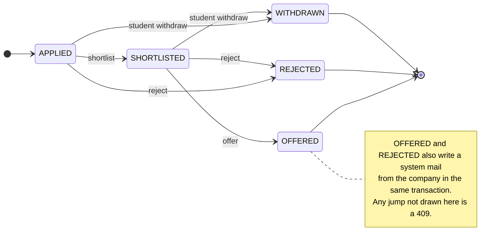
```mermaid
stateDiagram-v2
    direction LR
    [*] --> APPLIED
    APPLIED --> SHORTLISTED: shortlist
    SHORTLISTED --> OFFERED: offer
    APPLIED --> REJECTED: reject
    SHORTLISTED --> REJECTED: reject
    APPLIED --> WITHDRAWN: student withdraw
    SHORTLISTED --> WITHDRAWN: student withdraw
    OFFERED --> [*]
    REJECTED --> [*]
    WITHDRAWN --> [*]
    note right of OFFERED
        OFFERED and REJECTED also write a system mail
        from the company in the same transaction.
        Any jump not drawn here is a 409.
    end note
```

**Eligibility** (`evaluateEligibility`) is a pure function shared by client and
server: OPEN + in-window + same university + CGPA/branch/graduation-year gates +
complete profile. The server **always re-checks at apply time** — the UI is never
the gate. Branch matching is case-insensitive and trimmed; empty
`allowedBranches`/`allowedGraduationYears` mean no restriction.

Moving to **OFFERED**/**REJECTED** writes a system mail from the company to the
student **in the same transaction** as the status change — a decision can never
succeed while silently dropping the notification.

### 3. Code arena execution

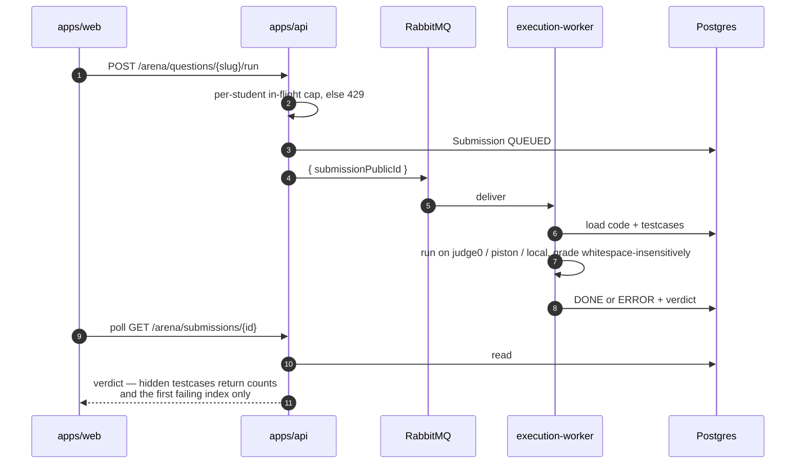
```mermaid
sequenceDiagram
    autonumber
    participant W as apps/web
    participant A as apps/api
    participant Q as RabbitMQ
    participant K as execution-worker
    participant P as Postgres

    W->>A: POST /arena/questions/{slug}/run
    A->>A: per-student in-flight cap, else 429
    A->>P: Submission QUEUED
    A->>Q: { submissionPublicId }
    Q->>K: deliver
    K->>P: load code + testcases
    K->>K: run on judge0 / piston / local, grade whitespace-insensitively
    K->>P: DONE or ERROR + verdict
    W->>A: poll GET /arena/submissions/{id}
    A->>P: read
    A-->>W: verdict — hidden testcases return counts<br/>and the first failing index only
```

Model is **stdin/stdout**: the program reads stdin and writes stdout; a testcase
is `(input, expectedOutput)`. Hidden testcases are never serialized — Submit
returns counts and the first failing index only. Per-student in-flight cap
(`ARENA_MAX_INFLIGHT`, default 3) → `429`.

### 4. Contests

A contest is **the arena pipeline in a timed window with a leaderboard** — the
worker, queue and grading are untouched. A contest submission is an ordinary
`Submission` tagged with `contestId`.

Phase is **derived from time** (`deriveContestPhase`), so there is no scheduler:

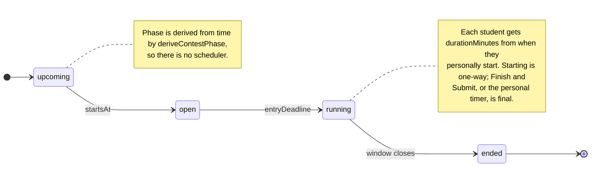
```mermaid
stateDiagram-v2
    direction LR
    [*] --> upcoming
    upcoming --> open: startsAt
    open --> running: entryDeadline
    running --> ended: window closes
    ended --> [*]
    note right of upcoming
        Phase is derived from time by deriveContestPhase,
        so there is no scheduler.
    end note
    note right of running
        Each student gets durationMinutes from when they
        personally start. Starting is one-way; Finish and
        Submit, or the personal timer, is final.
    end note
```

Each student gets `durationMinutes` **from when they personally start**, even if
that runs past the entry deadline. Starting is **one-way**: leaving and returning
resumes the same attempt; Finish & Submit (or the personal timer) is final.
Contest activity is excluded from practice-arena stats (`contestId = null`).

### 5. Webinars — one-to-many

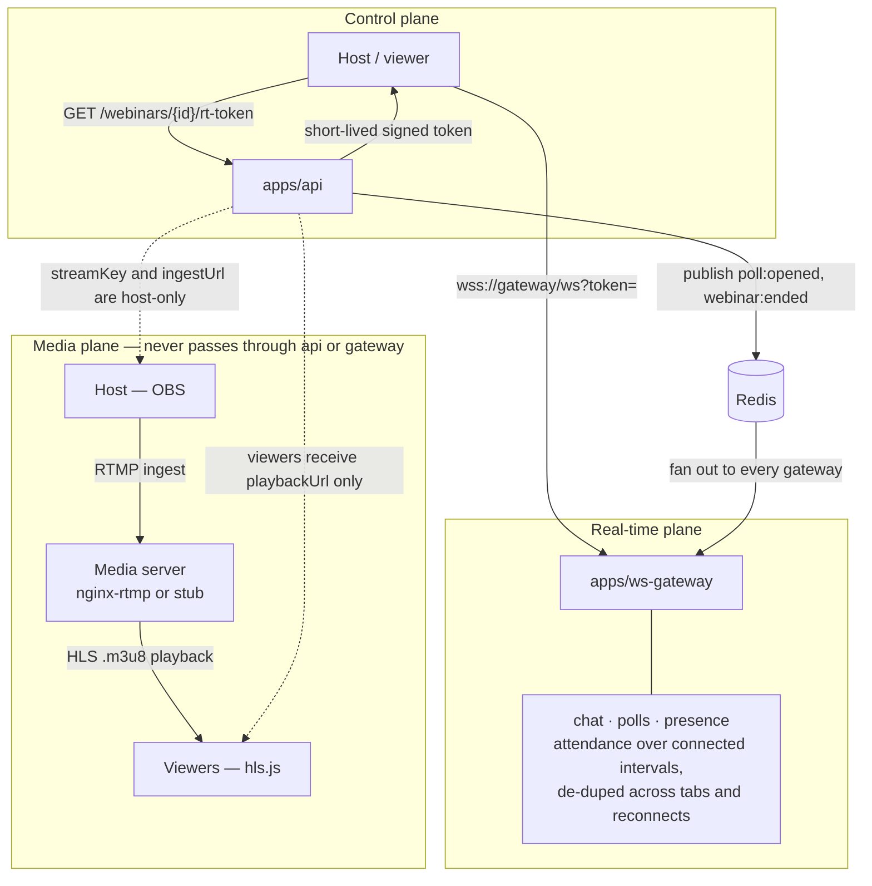
```mermaid
flowchart TB
    subgraph media["Media plane — never passes through api or gateway"]
        OBS["Host — OBS"] -->|"RTMP ingest"| MS["Media server<br/>nginx-rtmp or stub"]
        MS -->|"HLS .m3u8 playback"| VW["Viewers — hls.js"]
    end

    subgraph control["Control plane"]
        U["Host / viewer"] -->|"GET /webinars/{id}/rt-token"| API["apps/api"]
        API -->|"short-lived signed token"| U
    end

    subgraph realtime["Real-time plane"]
        U -->|"wss://gateway/ws?token="| GW["apps/ws-gateway"]
        GW --- ROOM["chat · polls · presence<br/>attendance over connected intervals,<br/>de-duped across tabs and reconnects"]
    end

    API -->|"publish poll:opened, webinar:ended"| R[("Redis")]
    R -->|"fan out to every gateway"| GW

    API -.->|"streamKey and ingestUrl are host-only"| OBS
    API -.->|"viewers receive playbackUrl only"| VW
```

`streamKey`/`ingestUrl` are **host-only secrets**; viewers receive only
`playbackUrl`. With `MEDIA_PROVIDER=stub` the entire room works and the player
honestly reports "stream not connected". Attendance accumulates over connected
intervals and de-dupes overlapping tabs and flaky reconnects.

### 6. Live interviews — few-to-few

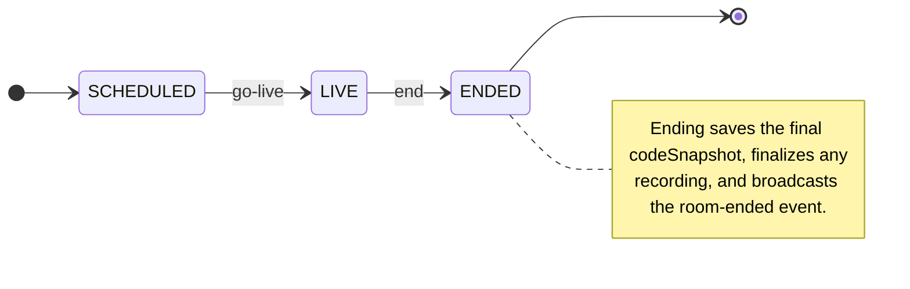
```mermaid
stateDiagram-v2
    direction LR
    [*] --> SCHEDULED
    SCHEDULED --> LIVE: go-live
    LIVE --> ENDED: end
    ENDED --> [*]
    note right of ENDED
        Ending saves the final codeSnapshot, finalizes any
        recording, and broadcasts the room-ended event.
    end note
```

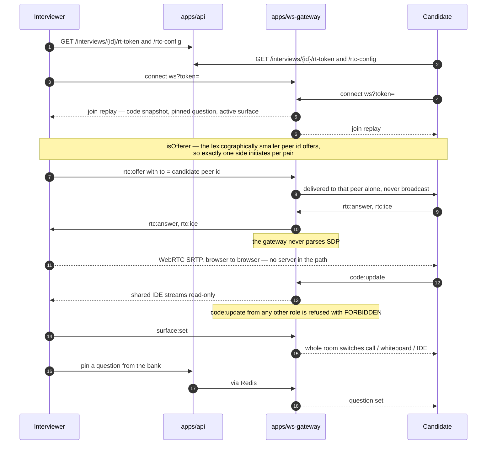
```mermaid
sequenceDiagram
    autonumber
    participant I as Interviewer
    participant API as apps/api
    participant GW as apps/ws-gateway
    participant C as Candidate

    I->>API: GET /interviews/{id}/rt-token and /rtc-config
    C->>API: GET /interviews/{id}/rt-token and /rtc-config
    I->>GW: connect ws?token=
    C->>GW: connect ws?token=
    GW-->>I: join replay — code snapshot, pinned question, active surface
    GW-->>C: join replay

    Note over I,C: isOfferer — the lexicographically smaller peer id offers,<br/>so exactly one side initiates per pair
    I->>GW: rtc:offer with to = candidate peer id
    GW->>C: delivered to that peer alone, never broadcast
    C->>GW: rtc:answer, rtc:ice
    GW->>I: rtc:answer, rtc:ice
    Note over GW: the gateway never parses SDP
    I-->>C: WebRTC SRTP, browser to browser — no server in the path

    C->>GW: code:update
    GW-->>I: shared IDE streams read-only
    Note over GW: code:update from any other role is refused with FORBIDDEN
    I->>GW: surface:set
    GW-->>C: whole room switches call / whiteboard / IDE
    I->>API: pin a question from the bank
    API->>GW: via Redis
    GW-->>C: question:set
```

Ending saves the final `codeSnapshot`, finalizes any recording, and broadcasts
`interview:ended`.

**Feedback is private**: one `InterviewFeedback` per interviewer (rating, notes,
recommendation), visible to the host org and admin only, **never** in any
candidate-facing DTO. It may advance a linked `Application` through one legal
transition, owned by the drive's company.

### 7. Recording and review

Because interview media is peer-to-peer, **there is no server-side stream to
record**. Capture happens in one elected interviewer's browser.

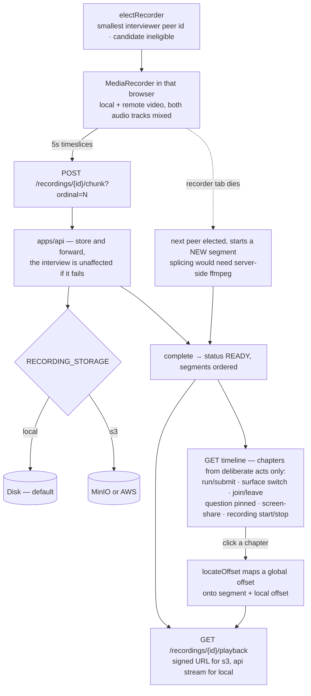
```mermaid
flowchart TB
    EL["electRecorder<br/>smallest interviewer peer id · candidate ineligible"] --> MR["MediaRecorder in that browser<br/>local + remote video, both audio tracks mixed"]
    MR -->|"5s timeslices"| UP["POST /recordings/{id}/chunk?ordinal=N"]
    UP --> API["apps/api — store and forward,<br/>the interview is unaffected if it fails"]
    API --> DRV{"RECORDING_STORAGE"}
    DRV -->|"local"| DISK[("Disk — default")]
    DRV -->|"s3"| S3[("MinIO or AWS")]

    API --> CMP["complete → status READY, segments ordered"]
    MR -.->|"recorder tab dies"| EL2["next peer elected, starts a NEW segment<br/>splicing would need server-side ffmpeg"]
    EL2 --> CMP

    CMP --> PB["GET /recordings/{id}/playback<br/>signed URL for s3, api stream for local"]
    CMP --> TL["GET timeline — chapters from deliberate acts only:<br/>run/submit · surface switch · join/leave<br/>question pinned · screen-share · recording start/stop"]
    TL -->|"click a chapter"| LOC["locateOffset maps a global offset<br/>onto segment + local offset"]
    LOC --> PB
```

**Consent is a functional requirement.** The candidate is told before capture
starts, and a _Recording_ indicator is shown to **everyone** in the room for the
whole duration — not just the person capturing.

**The timeline records deliberate acts only**: Run/Submit, surface switches,
join/leave, question pinned, screen-share, recording start/stop. Continuous
typing and drawing are **never** logged — "the candidate was typing" is not a
moment anyone seeks to, and logging it 1:1 would bury the ~20 marks that matter.

**Segments, not one file.** If the recorder's tab dies, the next elected peer
starts a **new segment**; splicing would require server-side ffmpeg. Playback
walks segments in order, and seeking maps a global offset onto
`(segment, localOffset)` via the pure, unit-tested `locateOffset`.

**Visibility matrix** — failure returns `404`, never `403`:

| Role       | Sees                                                     |
| ---------- | -------------------------------------------------------- |
| Student    | Only interviews where they were the **candidate**        |
| Recruiter  | Only interviews they were an **assigned interviewer** on |
| Company    | All recordings of interviews **it hosted**               |
| University | All recordings where the candidate is **its student**    |
| Admin      | All                                                      |

Delete removes the stored objects **and** the rows, and is audit-logged. The
candidate cannot delete the record of their own assessment.

---

## Data model

29 models across 11 migrations. Every model carries the base convention
(`id`, `publicId`, `createdAt`, `updatedAt`, `deletedAt`).

**Identity and the placement funnel**

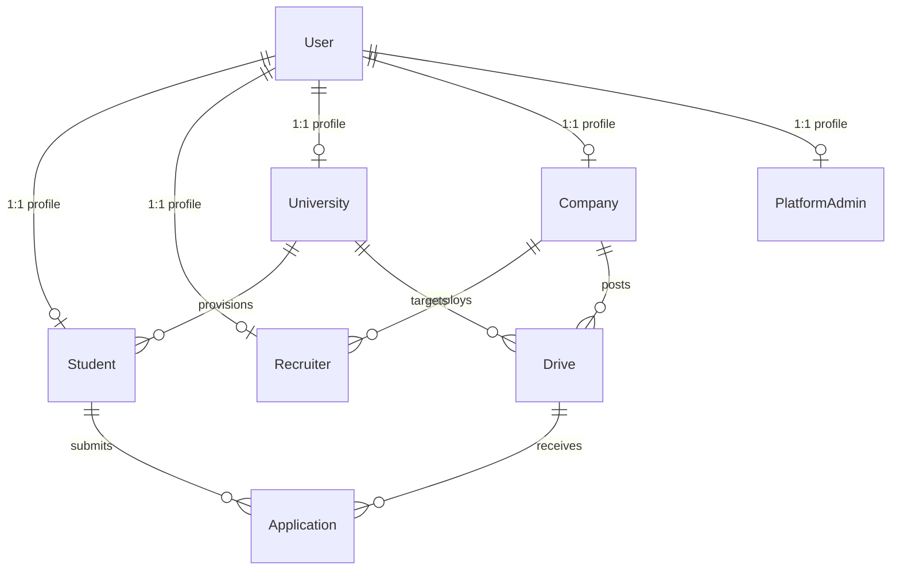
```mermaid
erDiagram
    User ||--o| Student : "1:1 profile"
    User ||--o| Recruiter : "1:1 profile"
    User ||--o| University : "1:1 profile"
    User ||--o| Company : "1:1 profile"
    User ||--o| PlatformAdmin : "1:1 profile"

    University ||--o{ Student : "provisions"
    Company ||--o{ Recruiter : "employs"
    Company ||--o{ Drive : "posts"
    University ||--o{ Drive : "targets"
    Drive ||--o{ Application : "receives"
    Student ||--o{ Application : "submits"
```

**Arena and contests — one pipeline, three entry points**

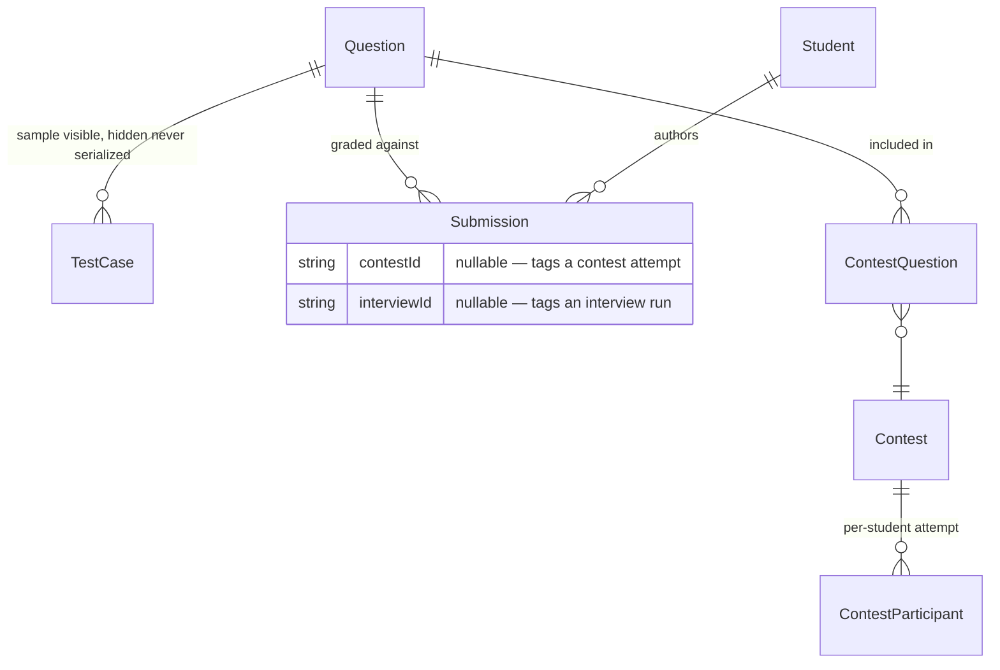
```mermaid
erDiagram
    Question ||--o{ TestCase : "sample visible, hidden never serialized"
    Question ||--o{ Submission : "graded against"
    Question ||--o{ ContestQuestion : "included in"
    ContestQuestion }o--|| Contest : ""
    Contest ||--o{ ContestParticipant : "per-student attempt"
    Student ||--o{ Submission : "authors"
    Submission {
        string contestId "nullable — tags a contest attempt"
        string interviewId "nullable — tags an interview run"
    }
```

**Webinars**

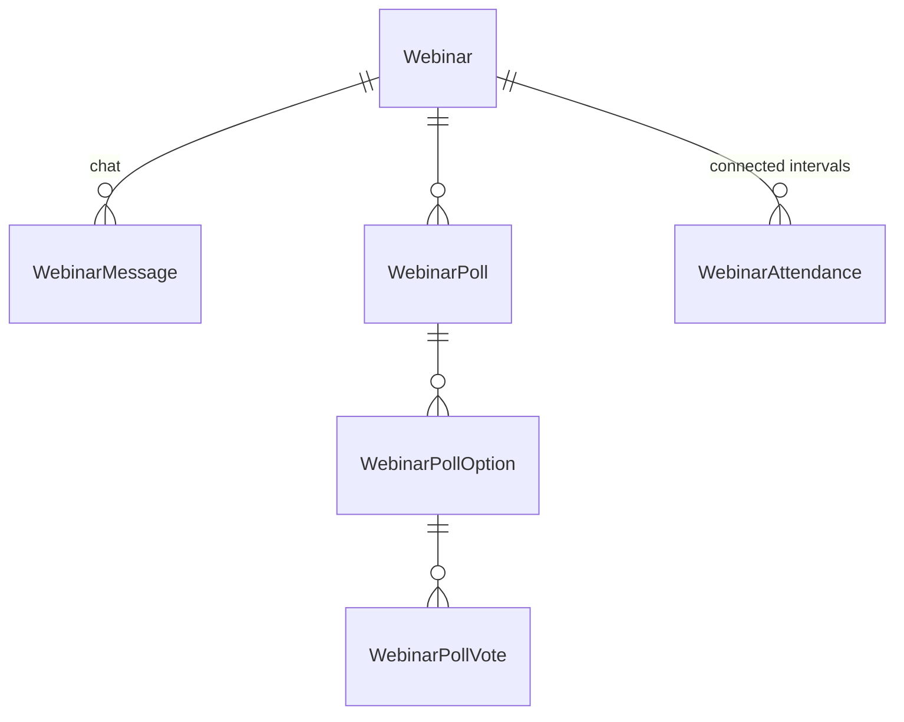
```mermaid
erDiagram
    Webinar ||--o{ WebinarMessage : "chat"
    Webinar ||--o{ WebinarPoll : ""
    Webinar ||--o{ WebinarAttendance : "connected intervals"
    WebinarPoll ||--o{ WebinarPollOption : ""
    WebinarPollOption ||--o{ WebinarPollVote : ""
```

**Interviews, recording and review**

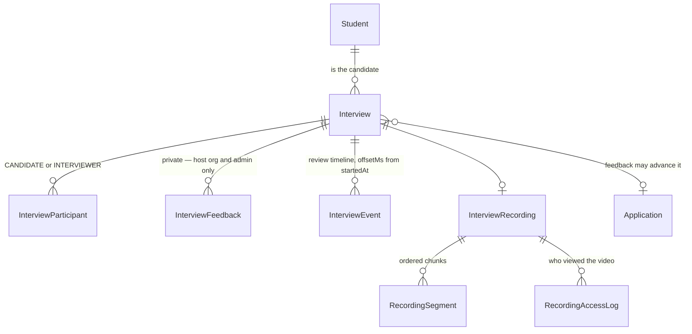
```mermaid
erDiagram
    Student ||--o{ Interview : "is the candidate"
    Interview ||--o{ InterviewParticipant : "CANDIDATE or INTERVIEWER"
    Interview ||--o{ InterviewFeedback : "private — host org and admin only"
    Interview ||--o{ InterviewEvent : "review timeline, offsetMs from startedAt"
    Interview ||--o| InterviewRecording : ""
    InterviewRecording ||--o{ RecordingSegment : "ordered chunks"
    InterviewRecording ||--o{ RecordingAccessLog : "who viewed the video"
    Interview }o--o| Application : "feedback may advance it"
```

**Mail**

```mermaid
erDiagram
    Mail ||--o{ MailRecipient : "per-recipient readAt"
    User ||--o{ Mail : "sends"
    User ||--o{ MailRecipient : "receives"
```

**Enums** (21): `Role`, `UserStatus`, `DriveStatus`, `ApplicationStatus`, `Topic`,
`Difficulty`, `ProgrammingLanguage`, `SubmissionKind`, `SubmissionStatus`,
`Verdict`, `ContestStatus`, `ContestHostKind`, `WebinarStatus`, `WebinarHostKind`,
`PollStatus`, `InterviewStatus`, `InterviewHostKind`, `ParticipantRole`,
`FeedbackRecommendation`, `RecordingStatus`, `InterviewEventKind`.

Every enum is mirrored as a string union in `@code-nexus/types`, so a schema
change that is not reflected in the contract fails typecheck.

---

## API reference

All routes require a session unless noted; mutations require CSRF.

### Auth & identity

| Method | Path                                           | Notes                    |
| ------ | ---------------------------------------------- | ------------------------ |
| POST   | `/auth/login` · `/auth/logout`                 | Public login             |
| GET    | `/auth/me`                                     | The only identity source |
| POST   | `/auth/password` · `/auth/complete-onboarding` | Onboarding gates         |
| GET    | `/health` · `/health/db`                       | Public                   |

### Provisioning

| Method   | Path                                                                  |
| -------- | --------------------------------------------------------------------- |
| POST     | `/admin/universities` · `/admin/companies` · `/admin/platform-admins` |
| GET/POST | `/universities/students` · `/companies/recruiters`                    |
| POST     | `/accounts/:publicId/reset-password` · `/suspend` · `/reactivate`     |

### Profile, dashboard, calendar

| Method  | Path                                                                                       |
| ------- | ------------------------------------------------------------------------------------------ |
| GET/PUT | `/me/profile` · PUT `/me/org`                                                              |
| GET     | `/dashboard` (role-dispatched) + `/dashboard/{student,university,company,recruiter,admin}` |
| GET     | `/calendar/events` — unified `DRIVE` / `CONTEST` / `WEBINAR` / `INTERVIEW`                 |

### Drives & applications

| Method   | Path                                                                                        |
| -------- | ------------------------------------------------------------------------------------------- |
| GET      | `/directory/universities`                                                                   |
| POST/GET | `/drives` · GET/PATCH `/drives/:publicId`                                                   |
| POST     | `/drives/:publicId/publish` · `/close`                                                      |
| GET      | `/drives/:publicId/applicants?branch=&minCgpa=&graduationYear=&status=&sort=`               |
| POST     | `/drives/:publicId/apply`                                                                   |
| GET      | `/applications` · POST `/applications/:publicId/withdraw` · PATCH `/applications/:publicId` |

### Mail

| Method | Path                                                                                          |
| ------ | --------------------------------------------------------------------------------------------- |
| POST   | `/mail`                                                                                       |
| GET    | `/mail/inbox` · `/mail/sent` · `/mail/unread-count` · `/mail/contacts?q=` · `/mail/:publicId` |

### Arena

| Method | Path                                                                                            |
| ------ | ----------------------------------------------------------------------------------------------- |
| GET    | `/arena/questions` · `/arena/questions/:slug` (samples only)                                    |
| POST   | `/arena/questions/:slug/run` · `/submit` → `202`                                                |
| GET    | `/arena/submissions` · `/arena/submissions/:publicId` · `/arena/heatmap?year=` · `/arena/stats` |

### Contests

| Method   | Path                                                             |
| -------- | ---------------------------------------------------------------- |
| POST/GET | `/contests` · GET/PATCH `/contests/:publicId`                    |
| POST     | `/contests/:publicId/publish` · `/cancel` · `/start` · `/finish` |
| POST/GET | `/contests/:publicId/questions` · DELETE `/questions/:slug`      |
| POST     | `/contests/:publicId/questions/:slug/run` · `/submit`            |
| GET      | `/contests/:publicId/leaderboard`                                |

### Webinars

| Method   | Path                                                                       |
| -------- | -------------------------------------------------------------------------- |
| POST/GET | `/webinars` · GET/PATCH `/webinars/:publicId`                              |
| POST     | `/webinars/:publicId/publish` · `/cancel` · `/go-live` · `/end`            |
| GET      | `/webinars/:publicId/rt-token` · `/messages?limit=` · `/attendance` (host) |
| GET/POST | `/webinars/:publicId/polls` · POST `/polls/:pollId/close`                  |

### Interviews

| Method   | Path                                                                       |
| -------- | -------------------------------------------------------------------------- |
| POST/GET | `/interviews` · GET/PATCH `/interviews/:publicId`                          |
| POST     | `/interviews/:publicId/cancel` · `/go-live` · `/end`                       |
| GET      | `/interviews/:publicId/question-bank?q=` (interviewer)                     |
| POST     | `/interviews/:publicId/question` — pin/clear, pushed live to the candidate |
| GET      | `/interviews/:publicId/rt-token` · `/rtc-config`                           |
| POST     | `/interviews/:publicId/run` (candidate only)                               |
| POST/GET | `/interviews/:publicId/feedback` (host/interviewer; never the candidate)   |

### Recordings

| Method | Path                                                                                    |
| ------ | --------------------------------------------------------------------------------------- |
| POST   | `/recordings/:interviewPublicId/start` · `/chunk?ordinal=&startOffsetMs=` · `/complete` |
| GET    | `/recordings` · `/recordings/:publicId`                                                 |
| GET    | `/recordings/:publicId/playback` — short-lived URLs, audit-logged                       |
| GET    | `/recordings/:publicId/stream/:ordinal` — local driver, **Range/206**                   |
| DELETE | `/recordings/:publicId` — erases objects + rows                                         |
| GET    | `/interviews/:interviewPublicId/events` — the timeline                                  |

### WSS event contract

Wire format `{ "t": <type>, … }`.

**Webinar rooms** — client: `chat:send`, `poll:vote`, `presence:heartbeat`;
server: `ready`, `chat:new`, `presence:count`, `poll:opened`, `poll:results`,
`poll:closed`, `webinar:ended`, `error`.

**Interview rooms** — client: `rtc:offer|answer|ice {to}`, `code:update`,
`whiteboard:stroke`, `chat:send`, `surface:set`, `presence:heartbeat`; server:
`ready {peerId, peers}`, `peer:joined`, `peer:left`, `rtc:* {from}`, `code:sync`,
`code:update`, `whiteboard:stroke`, `chat:new`, `surface:changed`, `question:set`,
`presence:count`, `interview:ended`, `error`.

---

## Environment variables

Validated by `@code-nexus/config`; the process **fails fast** on anything invalid.

| Variable                                                                  | Default                          | Purpose                                          |
| ------------------------------------------------------------------------- | -------------------------------- | ------------------------------------------------ |
| `NODE_ENV`, `API_PORT`, `LOG_LEVEL`                                       | `development`, `4000`, `info`    | Basics                                           |
| `DATABASE_URL`                                                            | —                                | Postgres (**required**)                          |
| `REDIS_URL`                                                               | —                                | Sessions + pub/sub (**required**)                |
| `SESSION_COOKIE_SECRET`                                                   | —                                | ≥16 chars (**required**)                         |
| `SESSION_ABSOLUTE_TTL_SECONDS`, `SESSION_IDLE_TTL_SECONDS`                |                                  | Session lifetime                                 |
| `BCRYPT_COST`, `PASSWORD_MIN_LENGTH`                                      |                                  | Credential policy                                |
| `WEB_ORIGIN`                                                              | `http://localhost:5173`          | CORS allowlist (comma-separated)                 |
| `RABBITMQ_URL`, `ARENA_QUEUE`                                             |                                  | Execution queue                                  |
| `EXECUTION_ENGINE`                                                        | `judge0`                         | `judge0` · `piston` · `local`                    |
| `PISTON_URL`, `JUDGE0_URL`, `JUDGE0_API_KEY`, `JUDGE0_API_HOST`           |                                  | Engine endpoints                                 |
| `ARENA_CPU_TIME_LIMIT`, `ARENA_MEMORY_LIMIT_KB`, `ARENA_WALL_TIME_LIMIT`  | `5`, `256000`, `10`              | Per-testcase caps                                |
| `ARENA_MAX_INFLIGHT`, `ARENA_WORKER_PREFETCH`                             | `3`, `2`                         | Backpressure                                     |
| `WS_GATEWAY_PORT`, `WS_GATEWAY_PUBLIC_URL`                                | `4100`, `ws://localhost:4100/ws` | Gateway                                          |
| `RT_TOKEN_SECRET`, `RT_TOKEN_TTL_SECONDS`                                 | dev default, `120`               | **Set a strong secret in prod**                  |
| `MEDIA_PROVIDER`                                                          | `stub`                           | `stub` · `selfhosted`                            |
| `RTMP_INGEST_BASE`, `HLS_PLAYBACK_BASE`                                   |                                  | Webinar media                                    |
| `RTC_STUN_URLS`                                                           | public STUN                      | WebRTC ICE                                       |
| `RTC_TURN_URL`, `RTC_TURN_USERNAME`, `RTC_TURN_CREDENTIAL`                | unset                            | Optional TURN for NAT traversal                  |
| `S3_ENDPOINT`, `S3_ACCESS_KEY`, `S3_SECRET_KEY`, `S3_BUCKET`, `S3_REGION` | MinIO defaults                   | Object storage                                   |
| `RECORDING_STORAGE`                                                       | `local`                          | `local` · `s3`                                   |
| `RECORDING_LOCAL_DIR`                                                     | `.data/recordings`               | Gitignored                                       |
| `RECORDING_MAX_CHUNK_BYTES`                                               | `8388608` (8 MB)                 | Per-chunk cap → `413`                            |
| `RECORDING_MAX_TOTAL_BYTES`                                               | `2147483648` (2 GB)              | Per-recording cap                                |
| `RECORDING_URL_TTL_SECONDS`                                               | `3600`                           | Playback URL lifetime                            |
| `RECORDING_RETENTION_DAYS`                                                | `0` (keep)                       | Documented horizon; **no automated sweeper yet** |

---

## Testing strategy

```
pnpm test      # 17 tasks · 505 tests
```

| Suite              | Count | Approach                                                                                             |
| ------------------ | ----- | ---------------------------------------------------------------------------------------------------- |
| `auth`             | 293   | Exhaustive role × permission matrix (268) + sessions, hashing, RT tokens                             |
| `types`            | 89    | Pure domain logic: state machines, eligibility, offerer election, write-locks, seek math, visibility |
| `api`              | 57    | supertest + real Postgres, asserting at the **api/persistence boundary**                             |
| `ws-gateway`       | 21    | Room registry and event buffer as **pure functions** — no sockets                                    |
| `execution-worker` | 19    | Engine adapters mocked; grading and idempotency                                                      |
| `web`              | 18    | Component tests with network/WebRTC mocked                                                           |

**The suites require no browser, no WebRTC, no TURN/SFU, no live gateway, no
Judge0, no S3 and no media server.** Integration tests self-skip without a
database. API integration files run **sequentially** (`fileParallelism: false`)
because they share one Postgres.

The testing rule throughout: **assert at the boundary, unit-test the pure logic.**
Anything that would need a browser is extracted into a pure function in
`@code-nexus/types` and tested there instead.

---

## Failure modes & graceful degradation

Every heavy dependency can be absent. What actually happens:

| Failure                         | Effect                                                               | Rest of the platform    |
| ------------------------------- | -------------------------------------------------------------------- | ----------------------- |
| RabbitMQ down / unset           | Run & Submit → `503`                                                 | Fully up                |
| Execution engine down           | Submissions → `ERROR` (never hang)                                   | Fully up                |
| ws-gateway down                 | Rooms show "connection unavailable"; client retries with backoff     | Fully up                |
| Redis pub/sub down              | Live fan-out skipped; all writes still persist                       | API up                  |
| **Redis down entirely**         | API **fails fast at boot** (sessions are unavailable)                | Down                    |
| No media server (`stub`)        | Webinar room works; player says "stream not connected"               | Fully up                |
| No TURN                         | STUN-only mesh; works on one network, may fail across symmetric NATs | Fully up                |
| Recording storage `null`        | Uploads → `503`                                                      | **Interview continues** |
| Browser without `MediaRecorder` | Recording disabled with an honest message                            | Interview works         |
| Recorder's tab dies             | New segment on re-election; earlier chunks intact                    | Interview works         |
| Postgres down                   | Fatal                                                                | Down                    |

---

## Design decisions

Where a specification left a choice, this is what was chosen and why.

**Architecture**

- **Modular monolith, not microservices.** One API process with strict module
  boundaries; only work that _must_ be isolated (untrusted code, long-lived
  sockets) got its own process. Isolation where it buys safety, not everywhere.
- **`404` for cross-tenant access**, so existence is not leaked; `403` only when a
  role lacks the permission outright.
- **Pure logic lives in `@code-nexus/types`**, not in services, so the same rule
  runs on client, API and gateway and is tested once.

**Auth**

- **Opaque Redis sessions over JWT** — revocable, and `role`/`status` reload live.
- **RT tokens for the socket** rather than the session cookie, so the gateway is
  stateless and cross-origin-safe.

**Execution**

- **The API never executes code.** Only `{ submissionPublicId }` crosses the
  broker; source and testcases are loaded from Postgres by the worker.
- **Pluggable engines** with `local` clearly marked demo-only.

**Real-time & media**

- **P2P mesh over an SFU** for interviews — 1:1/small-panel needs no media server.
  An SFU for large panels is deferred.
- **Lexicographic offerer election** (`isOfferer`) — one offerer per pair, no
  coordination.
- **Whole-document debounced code sync**, last-writer-wins. No CRDT/OT.
- **Shared surfaces are server-authoritative**: a client asks the gateway to
  switch, and everyone (including the asker) moves on the broadcast — so all
  participants converge on one value instead of optimistic local guesses.
- **The IDE is candidate-only, the whiteboard is collaborative.** The asymmetry is
  deliberate and enforced at the gateway, not just in the UI.
- **Interview chat and whiteboard are ephemeral** — it is a synchronous call.

**Recording**

- **Browser `MediaRecorder`, not an SFU recorder or headless browser** — there is
  no server-side stream to capture in a P2P mesh.
- **WebM as the browser produces it.** MP4 would require server-side ffmpeg.
- **Ordered segments, not one blob** — a dead recorder tab costs one segment
  boundary, not the interview.
- **Both audio tracks mixed** via `AudioContext` — a one-sided recording is broken,
  not partial.
- **Timeline = deliberate acts only.** Typing and drawing are never rows.
- **Consent and the recording indicator are functional requirements**, shown to
  everyone in the room for the whole capture.

**Product**

- **Money** is a whole-INR integer (`ctcAnnual`), never a float.
- **Contest attempts are one-way**; leaving and returning resumes the same timer.
- **Offer/reject mail is transactional** with the status change.
- **Feedback never reaches the student** in any DTO — verified by test.

---

## Known gaps

Honest list of what is not built.

- **No automated retention sweeper.** `RECORDING_RETENTION_DAYS` is documented and
  configurable; deletion is manual (host/admin) today.
- **No `SECURITY.md`**, no formal security review write-up.
- **No audit table.** Audit trails are structured logs plus `RecordingAccessLog`;
  a queryable admin audit table remains a TODO from Phase 2.
- **No tracing/metrics export.** Request-id correlation exists; OpenTelemetry does
  not.
- **No SFU** — interview panels beyond a few participants will strain a mesh.
- **No TURN provisioning** — cross-symmetric-NAT calls need one configured.
- **No CRDT/OT** for the shared editor (last-writer-wins).
- **Presence is per-gateway-instance**; cross-instance aggregate presence is a TODO.
- **Judge0 self-hosting is Linux-only** (isolate needs cgroups Docker Desktop does
  not expose); RapidAPI or `local` are the macOS paths.
- **No captions/transcription** for recordings.
- **Browser-native webinar publishing (WHIP)** is not implemented — hosts use OBS.

---

## Troubleshooting

**`pnpm dev` refuses to start** — "You have N persistent tasks but turbo is
configured for concurrency of 10". Fixed in `turbo.json` (`concurrency: 15`); if
you see it again, a new persistent task was added — raise it further.

**API/gateway log "Cannot reach Redis" and exit** — a container is holding 6379
without publishing it, or a stray Redis is bound to the port:

```bash
docker ps --format '{{.Names}}\t{{.Ports}}' | grep redis   # expect 0.0.0.0:6379->6379
docker compose up -d --force-recreate redis
```

**Interview room won't connect** — the gateway only serves **LIVE** rooms; a
non-live interview is refused with close code `4404`. Check the interview status
and that both participants are assigned.

**Two tabs behave like one user** — sessions are per-cookie-jar. Use a private
window or a second browser profile.

**Recording never starts** — capture begins only when the elected recorder is
connected _and_ a remote peer is present; a lone interviewer does not record.
Also confirm the browser supports `MediaRecorder`.

**Video won't seek** — the player scrubs via HTTP Range. Confirm the stream route
returns `206` with `Content-Range`; a `200` for a ranged request breaks seeking.

**Prisma cannot find `.env`** — the CLI is configured by
`packages/db/prisma.config.ts`, which loads the monorepo-root `.env`;
`@code-nexus/config` walks up to the workspace root too, so `pnpm dev` and `db:*`
work from any directory.

### Running without Docker

Any local Postgres 16 works — point `DATABASE_URL` at it:

```bash
initdb -D .pgdata -U postgres --auth=trust
pg_ctl -D .pgdata -o "-p 5432" start
createdb -h localhost -U postgres codenexus
psql -h localhost -U postgres -c "CREATE ROLE codenexus LOGIN SUPERUSER PASSWORD 'codenexus_dev_pw';"
pnpm db:migrate && pnpm db:seed
```

> **Constrained networks:** the lockfile is committed, so
> `pnpm install --frozen-lockfile` with a raised `fetch-timeout` and low
> `network-concurrency` is the reliable path. `.npmrc` already raises both.

---

## Notes & deviations

- **Node** — `.nvmrc` pins 20 LTS; `engines` allows `>=20`.
- **Password hashing** — `bcryptjs` (pure JS, no native build) for reproducible
  installs across machines and CI.
- **pnpm build scripts** — `pnpm-workspace.yaml#allowBuilds` explicitly approves
  install scripts for `esbuild`, `prisma`, `@prisma/client`, `@prisma/engines`
  (pnpm 10+ blocks dependency scripts by default).
  <<<<<<< HEAD
- **Phase specifications** — `prompt_phase1.md` … `prompt_phase10.md` record what
  each phase was asked to build; `report.md` holds the original architecture
  study. Where the shipped system diverges from `report.md` (notably: **P2P mesh
  instead of an SFU**, and therefore browser-side recording instead of SFU
  recording), this README is authoritative.
  \=======
- **Phase specifications** — the per-phase specs (`prompt_phase1.md` …
  `prompt_phase10.md`, referenced throughout the source comments) are kept
  locally and not published to this repository; `report.md` holds the original
  architecture study. Where the shipped system diverges from `report.md`
  (notably: **P2P mesh instead of an SFU**, and therefore browser-side recording
  instead of SFU recording), this README is authoritative.

> > > > > > > 3991721 (first implementation complete)
